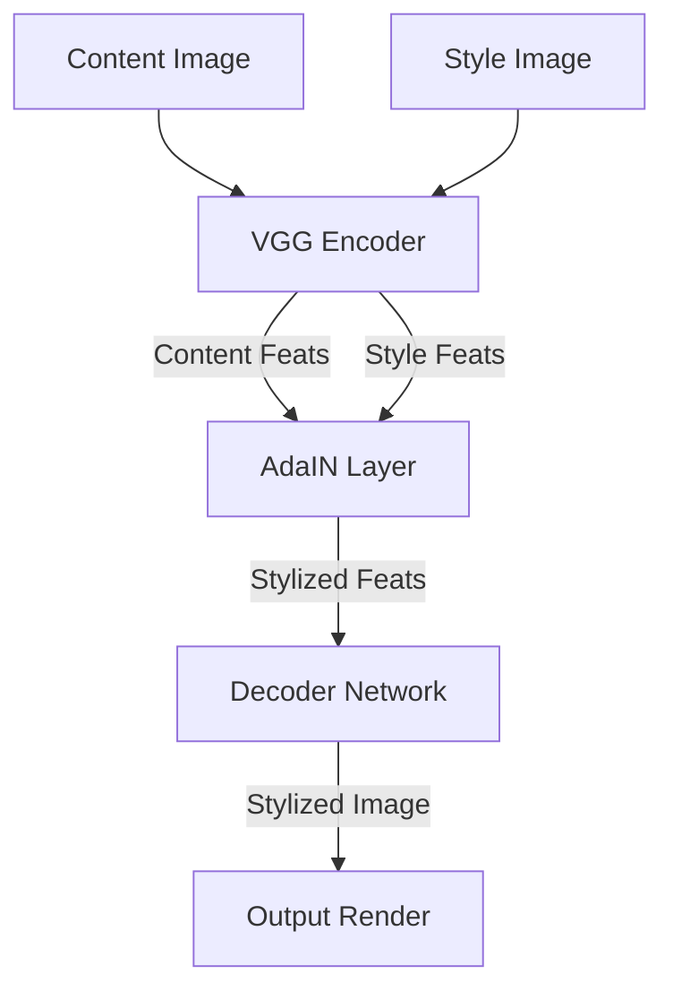

# 🎨 StyleForge Studio

StyleForge Studio is a high-performance **Neural Style Transfer (NST)** playground and web application. It enables users to blend content images with style reference images, interactively inspect results, and export stylized creations.

The system is uniquely designed for **dual-mode execution**: running heavy neural network inferences using **PyTorch on the server backend** or entirely client-side via **ONNX Runtime Web in the browser**.

---

## 🚀 Technology Stack


---

## 📐 Architecture & Pipeline

StyleForge Studio implements **Adaptive Instance Normalization (AdaIN)** (Huang & Belongie). It aligns the mean and variance of content features to match those of style features in the VGG-19 latent space.



### Dual-Inference Pipeline

```mermaid
sequenceDiagram
    autonumber
    actor User as User Browser
    rect rgb(30, 41, 59)
        note right of User: PyTorch Mode (Backend Server)
        User->>Server: POST /api/transfer (multipart/form-data)
        Server->>Server: Run VGGEncoder + AdaIN + Decoder (PyTorch)
        Server-->>User: Returns result image URL
    end
    rect rgb(18, 108, 106)
        note right of User: ONNX Mode (Client-Side Browser)
        User->>User: Load nst.onnx & nst.onnx.data (cached)
        User->>User: Run WebGL/WASM Inference
        User->>User: Render canvas & generate Data URL
    end
```



---

## ✨ Features

- **Dual-Mode Execution**:
  - **PyTorch Server**: Leverage backend deep learning pipelines (optimized with Copy-on-Write memory sharing using Gunicorn preload).
  - **Browser ONNX**: Run inference 100% client-side in the browser with ONNX Runtime Web, complete with a downloading progress bar for weights.
- **Interactive Workspace**:
  - Drag-and-drop content and style upload areas.
  - Curated content and style presets for instant testing.
  - Smooth interactive **Before/After comparison slider** to evaluate details.
- **Stats Dashboard**: Real-time stats on execution mode, output resolution, style strength ($\alpha$), and latency.
- **Adaptive Instance Normalization (AdaIN)**: Real-time style transfer algorithm with adjustable style-to-content strength.
- **Production-Ready**: Includes Docker configuration, Gunicorn tuning, and automatic temporary file cleanup.

---

## 📂 Project Structure

```directory
.
├── NST_Code/
│   ├── content_data/          # Default content preset datasets
│   ├── style_data/            # Default style preset datasets
│   ├── examples/              # High-quality example combinations
│   ├── experiment/
│   │   └── final_exp/
│   │       └── decoder_final.pth  # Trained decoder model checkpoint
│   ├── static/
│   │   ├── models/
│   │   │   ├── nst.onnx       # Client-side ONNX model graph
│   │   │   └── nst.onnx.data  # ONNX model weights data file
│   │   └── uploads/           # Temporary uploads directory (auto-cleaned)
│   ├── templates/
│   │   └── index.html         # Rich Responsive UI (Inter font, Glassmorphism theme)
│   ├── utils/
│   │   ├── __init__.py        # Utils package marker
│   │   ├── models.py          # VGGEncoder & Decoder PyTorch network architectures
│   │   └── utils.py           # AdaIN math operations & data loaders
│   ├── app.py                 # Main Flask server entry point
│   ├── train.py               # Model training script
│   └── gunicorn.conf.py       # Production server config
├── Dockerfile                 # Multi-stage lightweight deployment container
├── Procfile                   # Cloud platform process manager definition
└── requirements.txt           # Python package dependencies
```

---

## 🚀 Quick Start

### Prerequisites
Make sure you have Python (>= 3.10) installed.

### 1. Install Dependencies
```bash
pip install -r requirements.txt
```

### 2. Run the Web Application
```bash
cd NST_Code
python app.py
```
Open `http://localhost:5000` in your web browser.

---

## 🧪 Testing & Validation

StyleForge Studio includes a comprehensive unit and integration test suite of **17 tests** written using Python's standard `unittest` framework to ensure code correctness and regression safety.

### Running the Tests
To run the complete test suite:
```bash
cd NST_Code
python -m unittest discover -s tests -p "test_*.py" -v
```

### Test Scope
*   **Unit Tests ([test_models_and_utils.py](file:///e:/image/NST_Code/tests/test_models_and_utils.py))**: Tests PyTorch encoder/decoder forward passes, AdaIN math calculations, mean/std normalization layer shapes, and dataset loaders.
*   **Integration Tests ([test_app.py](file:///e:/image/NST_Code/tests/test_app.py))**: Tests Flask routing, favicon paths, and multiple routes on the style transfer REST API (`POST /api/transfer` with presets, custom uploads, parameter constraints, file format restrictions, and image size thresholds).
*   **ONNX Graph Validation ([test_onnx.py](file:///e:/image/NST_Code/tests/test_onnx.py))**: Tests the presence, file integrity, and schema shapes of the client-side ONNX model graph (`nst.onnx` and `nst.onnx.data`).

---

## 📊 Performance Benchmarks (CPU)

A detailed latency and memory usage profiling of the inference pipeline on CPU shows the following results:

| Benchmark Metric | Measured Result |
|---|---|
| **Model Loader Latency** | `~0.23 seconds` |
| **Model Parameters Size in RAM** | `~157.53 MB` |
| **256x256 Inference Time** | `0.69 seconds` (`1.44 FPS`) |
| **512x512 Inference Time** | `2.15 seconds` (`0.47 FPS`) |
| **Active Runtime RAM Footprint** | `~808 MB` |

To rerun the latency/memory benchmark:
```bash
cd NST_Code
python scratch/benchmark.py
```

---

## 🏋️ Model Training & Loss Formulations

The decoder is trained by minimizing the weighted combination of content loss ($\mathcal{L}_c$) and style loss ($\mathcal{L}_s$):

$$\mathcal{L} = \mathcal{L}_c + \gamma \mathcal{L}_s$$

Where:
- Content Loss is the mean squared error between stylized features and normalized features:
  $$\mathcal{L}_c = \| f(g(t)) - t \|_2$$
- Style Loss matches the mean and standard deviation of feature maps across multiple VGG-19 layers:
  $$\mathcal{L}_s = \sum_{i=1}^{L} \| \mu(\phi_i(g(t))) - \mu(\phi_i(s)) \|_2 + \sum_{i=1}^{L} \| \sigma(\phi_i(g(t))) - \sigma(\phi_i(s)) \|_2$$

To train a custom decoder checkpoint run:
```bash
python train.py --content_dir ./content_data --style_dir ./style_data --epochs 20 --batch_size 8
```

---

## 🔌 API Documentation

### Style Transfer
`POST /api/transfer`

Processes content and style references to generate a stylized output.

#### Request Parameters (Multipart form data or URL-encoded)
| Parameter | Type | Required | Description |
|---|---|---|---|
| `content` | `file` | No | File upload of the content image (supported: png, jpg, jpeg) |
| `style` | `file` | No | File upload of the style reference image (supported: png, jpg, jpeg) |
| `content_preset` | `string` | No | Name of a content preset (e.g., `brad_pitt.jpg`) |
| `style_preset` | `string` | No | Name of a style preset (e.g., `sketch.png`) |
| `alpha` | `float` | No | Style strength value between `0.0` and `1.0` (Default: `1.0`) |

*Note: You must provide either a file upload or a preset name for both the content and style images.*

#### Response Shapes
**Success (200 OK)**:
```json
{
  "success": true,
  "result_url": "/uploads/stylized_6a09aa2c_brad_pitt.jpg"
}
```

**Error (400 Bad Request)**:
```json
{
  "success": false,
  "error": "Alpha must be between 0.0 and 1.0."
}
```